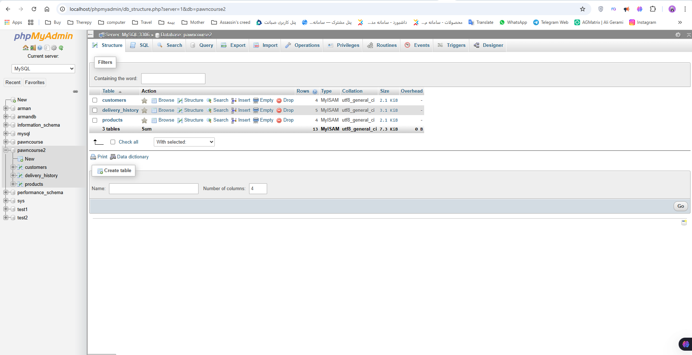

# 🚚 SA-MP Delivery Job System

A complete, professional delivery job system for SA-MP / open.mp multiplayer mod for GTA San Andreas.

## ✨ Features

### Core Systems
- ✅ MySQL database integration (products, customers, delivery history)
- ✅ Actor NPC at job start location
- ✅ Product & Customer selection dialogs
- ✅ Dynamic price calculation (distance × sensitivity)
- ✅ Pickup and destination checkpoints
- ✅ Job vehicle spawning (`/deliveryvehicle`)
- ✅ 2-minute timer on vehicle exit
- ✅ Payment system on delivery

### NO-REPEAT System (Hybrid)
- 🔄 Blocks same product to same customer for 1 hour
- ⏰ Automatic unlock after 1 hour
- 💾 Database tracking with `delivery_history` table
- 🎮 Players cannot exploit by reconnecting

### Optional Features
- 👥 Customer actors at destination locations
- 📦 Object in hand system (visible product while walking)
- 💬 Thank you message on delivery completion

## 📋 Commands

| Command | Description |
|---------|-------------|
| `/gotodelivery` | Teleport to job location |
| `/deliverprod` | Start a delivery job |
| `/deliveryvehicle` | Spawn delivery truck |
| `/deliveryhelp` | Show help menu |

## 🗄️ Database Structure

```sql
pawncourse2
├── products (id, name, base_price, sensitivity)
├── customers (id, name, pos_x, pos_y, pos_z)
└── delivery_history (id, player_name, product_id, customer_id, delivered_at)

## 📸 Screenshots
### Database structure



